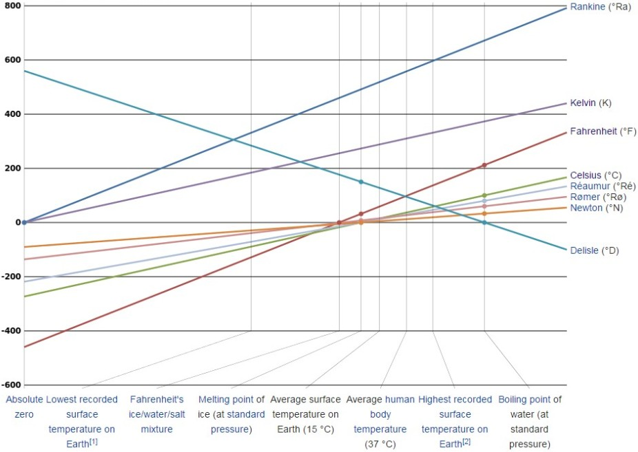

## Intro & Motivation

Temperature is an objective comparative measure of hot or cold. It is measured by a thermometer, which may work through the bulk behavior of a thermometric material, detection of thermal radiation, or particle kinetic energy. Several scales and units exist for measuring temperature, the most common being Celsius (denoted C; formerly called centigrade), Fahrenheit (denoted F), and, especially in science, Kelvin (denoted K).

The coldest theoretical temperature is absolute zero, at which the thermal motion in matter would be zero. However, an actual physical system or object can never attain a temperature of absolute zero. Absolute zero is denoted as 0 K on the Kelvin scale, 273.15 C negative on the Celsius scale, and 459.67 F negative on the Fahrenheit scale.

This application converts between this three most common temperature scales: Celsius, Fahrenheit and Kelvin. 

--- .class #id 

## Shiny App: Temperature Conversion

Enter temperature and select a conversion type. Just it and get your answer.

    

 

[Online Conversion - Temperature Conversion](https://help.shinyapps.io/DataProduct/)

---

## Other Features

* Beside the results tab, you'll find the documentation of the program instructions.
* The last tab contains interesting links regarding the temperature measurements and scales. For example, this graph of relationships between various temperature scale.

    

 

---

### Short Biography

#### Kelvin - William Thomson, 1st Baron Kelvin
Was an Irish mathematical physicist and engineer who was born in Belfast in 1824. At the University of Glasgow he did important work in the mathematical analysis of electricity and formulation of the first and second laws of thermodynamics, and did much to unify the emerging discipline of physics in its modern form.

#### Celsius - Anders Celsius
Anders Celsius was born in Uppsala, Sweden on 27 November 1701. His family originated from Ovanaker in the province of Halsingland. Their family estate was at Doma, also known as Hojen or Hogen (locally as Hogen). The name Celsius is a latinization of the estate's name (Latin celsus "mound").

#### Fahrenheit - Daniel Gabriel Fahrenheit
was born in 1686 in Danzig (Gdansk), in the Polish-Lithuanian Commonwealth, but lived most of his life in the Dutch Republic. The Fahrenheits were a German Hanse merchant family who had lived in several Hanseatic cities. Fahrenheit's great-grandfather had lived in Rostock, and research suggests that the Fahrenheit family originated in Hildesheim. Daniel's grandfather moved from Kneiphof in Konigsberg to Danzig and settled there as a merchant in 1650. 

